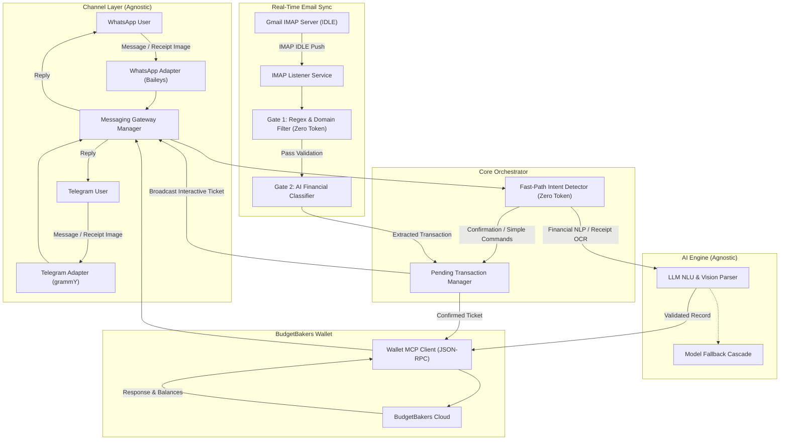

# AI Bookkeeper for BudgetBakers Wallet (WhatsApp & Telegram)

[](https://github.com/Churma16/wallet-mcp-budgetbakers-bot/actions/workflows/ci.yml) [](https://www.typescriptlang.org/) [](https://nodejs.org/) [](https://aistudio.google.com/) [](https://github.com/WhiskeySockets/Baileys) [](https://grammy.dev/) [](https://web.budgetbakers.com/settings/mcp-server) [](LICENSE)

An automated personal bookkeeping assistant via **WhatsApp** and **Telegram** integrated directly with BudgetBakers Wallet through the official Model Context Protocol (MCP) Streamable HTTP endpoint. Powered by an agnostic AI provider (Google Gemini, OpenRouter, Groq, Ollama, OpenAI — currently only tested for Gemini API), the system converts natural language chats and physical receipt photos into structured wallet records, monitors bank/e-wallet notification emails in real time, and requests interactive confirmation before committing financial records.

<details>
<summary><b>Table of Contents</b></summary>

- [Architecture Flow](#architecture-flow)
- [Key Features](#key-features)
- [Tech Stack & Libraries](#tech-stack--libraries)
- [Prerequisites](#prerequisites)
- [Generating a BudgetBakers Wallet MCP Token](#generating-a-budgetbakers-wallet-mcp-token)
- [Installation & Setup](#installation--setup)
  - [3-Minute Quickstart](#3-minute-quickstart)
  - [1. Clone and Install Dependencies](#1-clone-and-install-dependencies)
  - [2. Environment Configuration (Stage 1 to 3)](#2-environment-configuration)
  - [3. Verify Integrations & Connection Tests](#3-verify-integrations--connection-tests)
- [Usage Scenarios & Commands](#usage-scenarios--commands)
- [Project Structure](#project-structure)
- [Security & Privacy Considerations](#security--privacy-considerations)
- [Disclaimer, Legal Notice & Risk Warning](#disclaimer-legal-notice--risk-warning)
- [Release & Versioning](#release--versioning)
- [Community, Support & Feedback](#community-support--feedback)
- [Contributing](#contributing)
- [License](#license)

</details>

---

## Architecture Flow



---

## Key Features

- **Natural Language Transaction Recording**: Parse casual shorthand in Indonesian or English (e.g., *"Kopi kenangan 28rb bca"*, *"Lunch sandwich $7.50 cash"*, *"Gaji masuk 7.5jt ke Mandiri"*).
- **Physical Receipt Photo OCR**: Send photos of physical paper receipts or invoices; AI vision extracts merchant, transaction timestamp, line items, total amount, and categorizes automatically.
- **Priority-Based Multi-Provider AI Fallback**: Configure ordered fallback chains across AI providers (e.g., `AI_PROVIDER=gemini,openrouter`). Automatically fails over from primary models (Gemini) to secondary providers (OpenRouter free models, Groq) during rate limits (HTTP 429) or service outages (HTTP 503) with zero message drops.
- **Account-Aware Multi-Currency & Precision Formatting**: Automatically inspects account currencies configured in BudgetBakers Wallet (e.g. USD, EUR, IDR, SGD, GBP) and formats amounts accordingly with proper decimal precision (e.g., `$5.75` vs `Rp 45.000`).
- **Multi-Language Support (i18n)**: Fully localized human responses and interactive ticket confirmations in **Bahasa Indonesia** (`id`) and **English** (`en`), configurable via `APP_LANGUAGE`.
- **Configurable Timezone**: Formats transaction receipts and contextual timestamps matching your IANA timezone (e.g., `Asia/Jakarta`, `America/New_York`, `Europe/London`).
- **Real-Time Bank & E-Wallet Email Sync**: Automatically monitors transaction emails via Gmail IMAP IDLE for **Bank Mandiri (Livin), Bank Jago, GoPay, OVO, DANA, and ShopeePay**.
- **Two-Gate Spam & Promo Defense Engine**:
  - **Gate 1**: Header, sender domain, regex validation, security keyword blacklist (OTP, login alerts, promos), and in-memory deduplication (zero AI tokens spent).
  - **Gate 2**: AI structured schema extraction for verified financial notifications.
- **Interactive Multi-Channel Confirmation Queue**: Bank email transactions generate numbered interactive tickets (`#1`, `#2`) broadcasted to WhatsApp and Telegram. Confirm individually (`Ya 1` / `Yes 1`), in bulk (`Ya semua` / `Yes all`), or cancel (`Batal 1` / `Cancel 1`).
- **Transaction History & Pagination**: View recent transactions with configurable limits and deterministic sorting (*"riwayat"*, *"history 5"*, *"riwayat hal 2"*, *"history oldest"*). Automatically bounded with safety caps (default 10, max 50) and navigation hints.
- **Budget & Balance Inquiries**: Check balances across accounts (*"Cek saldo rekening"*, *"Check balance"*, *"Berapa sisa BCA?"*) or inspect budget limits (*"Status budget bulan ini"*, *"Budget status"*).
- **Zero-Token Fast-Path Processor**: Bilingual confirmation commands, history queries, and simple keywords bypass LLM processing entirely for instant response times and token savings.
- **Channel Security Whitelist**: Strict WhatsApp phone number and Telegram User ID whitelist restrictions ensure only authorized users can interact with the bot.

---

## Tech Stack & Libraries

- **Language & Runtime**: TypeScript 5.x on Node.js (tested on LTS v18 and v20+ via `tsx`)
- **AI / NLU Engine**: Agnostic AI Provider supporting Google Gemini API via `@google/genai`, plus OpenRouter, Groq, Ollama, OpenAI (*currently only tested with Gemini API*)
- **Messaging Gateways**:
  - WhatsApp: `@whiskeysockets/baileys` (Multi-device WhatsApp Web socket API)
  - Telegram: `grammy` (Modern, native TypeScript Telegram Bot framework)
- **MCP Client**: Custom JSON-RPC over HTTP client targeting BudgetBakers Wallet MCP Server
- **Email Synchronization**: `imapflow` (IMAP IDLE push events) and `mailparser` (RFC 822 stream parsing)
- **Logging**: `pino` with rotating daily file logs and clean console output

---

## Prerequisites

1. **Node.js**: Version 18.0.0 or higher.
2. **AI Provider API Key**:
   - Google Gemini: Obtain a free key from [Google AI Studio](https://aistudio.google.com) (*currently only tested with Gemini API*).
   - Or OpenRouter / Groq / OpenAI / Ollama.
3. **BudgetBakers Wallet MCP Token**:
   - Generate a **Personal Access Token** with required scopes (`records.create`, `records.read`, `accounts.read`, `categories.read`, `budgets.read`) by following the [step-by-step instructions below](#generating-a-budgetbakers-wallet-mcp-token).
4. **Messaging Credentials (At least one required)**:
   - **WhatsApp**: Your phone number for `ALLOWED_PHONE_NUMBER`.
   - **Telegram**: A bot token from [@BotFather](https://t.me/BotFather) (`TELEGRAM_BOT_TOKEN`) and your Telegram user ID from [@userinfobot](https://t.me/userinfobot) (`TELEGRAM_ALLOWED_USER_ID`).
5. **Google App Password (Optional for Email Sync)**:
   - If enabling real-time bank email monitoring:
     1. Enable 2-Step Verification on your Google Account.
     2. Navigate to Google Account > Security > App Passwords.
     3. Create an app password (e.g., named "Wallet Bot") and keep the 16-character secret.

---

## Generating a BudgetBakers Wallet MCP Token

Your `WALLET_MCP_ACCESS_TOKEN` is a **Personal Access Token** issued by BudgetBakers for their official Wallet MCP server. To generate one:

1. **Log in** to your Wallet account at [BudgetBakers Web App](https://web.budgetbakers.com).
2. Open **Settings** (gear icon) from the sidebar.
3. Click **MCP Server** in the left-hand settings menu.
4. Under the **Personal Access Tokens** section, click **Create Access Token** (or **Generate New Token**).
5. Give the token a recognizable name (e.g., `Wallet Bot`).
6. Select the **required scopes**:
   - `records.create`
   - `records.read`
   - `accounts.read`
   - `categories.read`
   - `budgets.read`
7. Click **Create / Generate** and **copy the token immediately** — it is displayed only once and starts with the prefix `pat_...`.

Then paste it into `WALLET_MCP_ACCESS_TOKEN` in your `.env` file:

```bash
WALLET_MCP_ACCESS_TOKEN=pat_your_generated_token_here
```

> [!IMPORTANT]
> Treat your Personal Access Token like a password. Never commit it to version control or share it — it grants direct API access to your Wallet records. If it is ever leaked, revoke it immediately from the same **Settings > MCP Server** page and generate a replacement.

Direct link: [BudgetBakers MCP Server Settings](https://web.budgetbakers.com/settings/mcp-server).

---

## Installation & Setup

> [!TIP]
> **Just want it running in 3 minutes?** Follow the [3-Minute Quickstart](#3-minute-quickstart) below. Everything else in this section is optional tuning for power users.

### 3-Minute Quickstart

The fastest path from zero to a working bot requires exactly **4 environment variables**:

1. **Clone and install** the project:
   ```bash
   git clone https://github.com/Churma16/wallet-mcp-budgetbakers-bot.git
   cd wallet-mcp-budgetbakers-bot
   npm install
   ```
2. **Copy the environment template** and set the 4 mandatory variables below:
   ```bash
   cp .env.example .env
   ```

   | Variable | What to put | Where to get it |
   | :--- | :--- | :--- |
   | `WALLET_MCP_BASE_URL` | BudgetBakers Wallet MCP endpoint | Use the default `https://mcp.wallet.budgetbakers.com` |
   | `WALLET_MCP_ACCESS_TOKEN` | Your Wallet MCP Personal Access Token (`pat_...`) | See [step-by-step instructions](#generating-a-budgetbakers-wallet-mcp-token) |
   | `GEMINI_API_KEY` | Your Google Gemini API key | Free key at [Google AI Studio](https://aistudio.google.com) |
   | `ALLOWED_PHONE_NUMBER` | Your own WhatsApp number (international format, no `+`) | e.g. `6281234567890` |

   > [!NOTE]
   > Using **Telegram** instead of WhatsApp? Replace `ALLOWED_PHONE_NUMBER` with `TELEGRAM_BOT_TOKEN` (from [@BotFather](https://t.me/BotFather)) and `TELEGRAM_ALLOWED_USER_ID` (from [@userinfobot](https://t.me/userinfobot)).

   > [!IMPORTANT]
   > **Non-Indonesian / International Users**: The bot defaults to Indonesian (`id`), `IDR`, and `Asia/Jakarta`. If you are outside Indonesia, make sure to set the three localization variables in **Stage 1D** (`APP_LANGUAGE=en`, `DEFAULT_CURRENCY`, `APP_TIMEZONE`) to match your language, currency, and local timezone.

3. **Run the bot**:
   ```bash
   npm start
   ```

   - **WhatsApp**: scan the QR code shown in the terminal via WhatsApp > **Settings** > **Linked Devices** > **Link a Device**.
   - **Telegram**: send `/start` to your bot from your whitelisted account.

Your bot is now live. Continue below only when you want to enable extra channels, AI fallbacks, or email sync.

---

### 1. Clone and Install Dependencies

```bash
git clone https://github.com/Churma16/wallet-mcp-budgetbakers-bot.git
cd wallet-mcp-budgetbakers-bot
npm install
```

### 2. Environment Configuration

Copy the example environment file and populate your credentials:

```bash
cp .env.example .env
```

The configuration is structured into **three setup stages**, guiding you from minimum required credentials to optional add-ons and advanced tuning:

#### Stage 1: Minimum Required to Run the Bot (Core Prerequisites)
Fill in these credentials to get the bot running immediately.

**1A. BudgetBakers Wallet MCP Server:**
| Variable | Description | Example / Default |
| :--- | :--- | :--- |
| `WALLET_MCP_BASE_URL` | BudgetBakers Wallet MCP HTTP endpoint | `https://mcp.wallet.budgetbakers.com` |
| `WALLET_MCP_ACCESS_TOKEN` | BudgetBakers Personal Access Token with required scopes | `pat_...` |

**1B. AI Provider Configuration:**
| Variable | Description | Example / Default |
| :--- | :--- | :--- |
| `AI_PROVIDER` | Active AI provider or comma-separated priority order (`gemini`, `openrouter`, `groq`, `ollama`, `openai`, `custom`, or e.g. `gemini,openrouter`) | `gemini` |
| `GEMINI_API_KEY` | Google Gemini API key (from [Google AI Studio](https://aistudio.google.com)) | `AIzaSy...` |
| `GEMINI_MODEL` | Primary Gemini model identifier | `gemini-3.5-flash-lite` |
| `GEMINI_FALLBACK_MODELS` | Comma-separated cascade fallback models | `gemini-3.5-flash,gemini-3.6-flash` |
| `GEMINI_TIMEOUT_SECONDS` | Request timeout before triggering fallback | `20` |
| `OPENROUTER_API_KEY` | OpenRouter API Key (required if `openrouter` is in `AI_PROVIDER`) | `sk-or-v1-...` |
| `GROQ_API_KEY` | Groq API Key (required if `groq` is in `AI_PROVIDER`) | `gsk_...` |
| `OPENAI_API_KEY` | OpenAI API Key (required if `openai` is in `AI_PROVIDER`) | `sk-...` |
| `AI_API_KEY` | Generic API key for custom OpenAI-compatible endpoint | `sk-...` |
| `AI_BASE_URL` | Custom endpoint for OpenAI-compatible providers | `https://openrouter.ai/api/v1` |
| `AI_MODEL` | Active model for OpenRouter / Groq / Ollama / OpenAI | `meta-llama/llama-3.3-70b-instruct:free` |
| `AI_FALLBACK_MODELS` | Comma-separated fallback models for alternative providers | `google/gemini-2.0-flash-exp:free` |
| `AI_TIMEOUT_SECONDS` | Request timeout in seconds for alternative AI providers | `25` |

> [!TIP]
> **Recommended Multi-Provider Fallback Setup**:
> Set `AI_PROVIDER=gemini,openrouter` with your `GEMINI_API_KEY` and `OPENROUTER_API_KEY`. The bot will utilize Gemini's high-speed native multimodal engine, and automatically fail over to OpenRouter free models (e.g. `meta-llama/llama-3.3-70b-instruct:free`) if Gemini hits rate limits (`429`) or server overload (`503`).

**1C. Messaging Channels (Choose at least one: WhatsApp or Telegram):**
| Variable | Description | Example / Default |
| :--- | :--- | :--- |
| `ENABLED_MESSENGER_CHANNELS` | Active messaging channels (`whatsapp`, `telegram`, or `whatsapp,telegram`) | Auto-detect |
| `ALLOWED_PHONE_NUMBER` | Authorized WhatsApp number in international format (whitelist) | `6281234567890` |
| `WHATSAPP_SESSION_PATH` | Local directory for multi-device session credentials | `./auth_session` |
| `TELEGRAM_BOT_TOKEN` | Telegram Bot Token from @BotFather | `123456789:ABC...` |
| `TELEGRAM_ALLOWED_USER_ID` | Telegram User ID whitelist security | `123456789` |

**1D. Localization & Regional Preferences (Recommended for International Users):**
| Variable | Description | Example / Default |
| :--- | :--- | :--- |
| `APP_LANGUAGE` | Bot response language (`id` for Indonesian, `en` for English) | `id` |
| `DEFAULT_CURRENCY` | Fallback and summary currency code (e.g., `IDR`, `USD`, `EUR`, `SGD`) | `IDR` |
| `APP_TIMEZONE` | IANA Timezone identifier for timestamps and receipts | `Asia/Jakarta` |

> [!IMPORTANT]
> The bot ships with Indonesian defaults (`id`, `IDR`, `Asia/Jakarta`). If you live outside Indonesia, set `APP_LANGUAGE=en`, adjust `DEFAULT_CURRENCY`, and pick your [IANA timezone](https://en.wikipedia.org/wiki/List_of_tz_database_time_zones) (e.g. `America/New_York`, `Europe/London`, `Asia/Singapore`) to avoid receiving responses in Indonesian with unexpected timezone offsets.

#### Stage 2: Optional Add-On Features (Real-Time Bank Sync)
Configure if you want real-time financial tracking from email notifications.

| Variable | Description | Example / Default |
| :--- | :--- | :--- |
| `EMAIL_SYNC_ENABLED` | Toggle real-time bank email sync via IMAP | `false` |
| `EMAIL_IMAP_HOST` | IMAP server host address | `imap.gmail.com` |
| `EMAIL_IMAP_PORT` | IMAP SSL port | `993` |
| `EMAIL_IMAP_USER` | Gmail address receiving bank notifications | `user@gmail.com` |
| `EMAIL_IMAP_PASSWORD` | 16-character Google App Password | `abcd efgh ijkl mnop` |
| `EMAIL_LOOKBACK_MINUTES`| Lookback window on initial startup to prevent flooding | `10` |

#### Stage 3: Advanced System Safeguards & Anti-Ban Tuning
All settings below have sensible built-in defaults. Change only if needed. This stage is dedicated exclusively to system safeguards, throttling, and anti-ban configuration.

| Variable | Description | Example / Default |
| :--- | :--- | :--- |
| `WHATSAPP_MAX_RECONNECT_ATTEMPTS` | Maximum WhatsApp reconnection attempts before backoff | `6` |
| `WHATSAPP_RECONNECT_MAX_BACKOFF_SECONDS` | Maximum backoff interval in seconds during reconnection | `300` |
| `WHATSAPP_MESSAGE_QUEUE_INTERVAL_MS` | Outbound message queue throttle interval (anti-rate-limit) | `1000` |
| `WHATSAPP_TYPING_PRESENCE_COOLDOWN_MS` | Simulated typing presence cooldown in milliseconds | `2500` |
| `TELEGRAM_MAX_STARTUP_ATTEMPTS` | Maximum startup retry attempts for Telegram connection | `5` |
| `TELEGRAM_STARTUP_RETRY_DELAY_MS` | Delay between Telegram startup connection retries in ms | `2000` |
| `MAX_MEDIA_DOWNLOAD_MB` | Maximum media download size limit in MB (buffer protection) | `10` |
| `LOG_RETENTION_DAYS` | Daily file logging retention period in days | `7` |

### 3. Verify Integrations & Connection Tests

Run built-in diagnostic scripts to confirm API connectivity and system health:

```bash
# --- Core Connectivity & Diagnostic Tests ---
# Verify Wallet MCP credentials, scopes, accounts, and categories
npm run test:mcp

# Verify active AI Provider NLU and email transaction extraction
npm run test:ai

# Verify priority-based multi-provider AI fallback and cascade failover
npm run test:ai-fallback

# Verify native Google Gemini AI service
npm run test:gemini

# Verify Telegram Bot API token & whitelisted user dispatch
npm run test:telegram

# Verify Gmail IMAP connection & credentials (if email sync is enabled)
npm run test:email

# --- Channel Safeguards & Resilience Tests ---
# Verify WhatsApp session recovery and message queue rate-limiting
npm run test:whatsapp-safeguards

# Verify WhatsApp socket reconnection and backoff hardening
npm run test:whatsapp-hardening

# Verify Telegram startup retry and connection resilience
npm run test:telegram-safeguards

# Verify multi-channel messaging gateway failover and dispatch resilience
npm run test:gateway-resilience

# --- Business Logic, Rules & Security Tests ---
# Verify Gate 1 bank email regex patterns and confirmation intent detection
npm run test:email-rules

# Test live email fetching and Gate 1 filtering against your inbox
npm run test:email-gate-live

# Verify receipt vision OCR prompts and extraction schemas
npm run test:receipt-ocr

# Verify media download size limits and memory protection
npm run test:media-limits

# Verify sensitive data redaction in logger outputs
npm run test:redaction

# Verify message markup formatting and HTML escaping
npm run test:format

# Verify human-friendly response strings and currency formatting
npm run test:formatter

# Verify response dictionary & multi-language localization (i18n)
npm run test:i18n
```

### 4. Start the Application

Start in development mode with auto-reload:
```bash
npm run dev
```

Or start for production:
```bash
npm start
```

**Messaging Channel Setup:**
- **WhatsApp**:
  1. A QR code will display in the terminal upon startup.
  2. Open WhatsApp: Settings > **Linked Devices** > **Link a Device** and scan.
  3. Credentials persist inside `./auth_session`. Subsequent restarts reconnect automatically.
- **Telegram**:
  1. Set `TELEGRAM_BOT_TOKEN` and `TELEGRAM_ALLOWED_USER_ID` in `.env`.
  2. Start your bot on Telegram by sending `/start` from your whitelisted user account.

---

## Usage Scenarios & Commands

Send messages from your whitelisted WhatsApp or Telegram account to the bot:

| Scenario | Message Example (WhatsApp / Telegram) | System Action |
| :--- | :--- | :--- |
| **Expense Recording** | *"Kopi kenangan 28rb bca"* or *"Lunch salad $8.50 cash"* | Resolves account, categorizes appropriately, creates expense record with correct currency. |
| **Detailed Expense** | *"Beli bensin pertamax 50rb cash, note: rest area km 57"* | Creates expense under `Cash` with category `Transportation` and custom note. |
| **Income Recording** | *"Gaji masuk 7.5jt ke Mandiri"* or *"Salary received $3500 into Checking"* | Resolves account, categorizes as `Salary` / income, creates income record. |
| **Receipt OCR** | Send an image of a physical receipt | Extracts merchant name, line items, transaction date, and creates record. |
| **Confirm Single Email** | *"Ya"* / *"Catat"* or *"Yes"* / *"Save"* | Confirms and records the most recent bank email notification ticket. |
| **Confirm Specific Ticket**| *"Ya 1"* / *"Catat #2"* or *"Yes 1"* / *"Save #2"* | Confirms and records ticket `#1` or `#2` from the queue. |
| **Bulk Confirmation** | *"Ya semua"* / *"Catat semua"* or *"Yes all"* / *"Save all"* | Processes and records all pending tickets sequentially. |
| **Cancel Ticket** | *"Batal 1"* / *"Batal semua"* or *"Cancel 1"* / *"Cancel all"* | Dismisses transaction tickets from the pending queue. |
| **Check Balances** | *"Cek saldo rekening"* or *"Check balance BCA"* | Queries Wallet MCP and lists current balances for specified or all accounts. |
| **Check Budgets** | *"Status budget bulan ini"* or *"Budget status"* | Queries Wallet MCP and summarizes spending limits vs remaining amounts. |

---

## Project Structure

```
wallet-mcp-budgetbakers-bot/
├── src/
│   ├── config/
│   │   ├── bankEmailRules.ts            # Rule definitions for Mandiri, Jago, GoPay, OVO, DANA, ShopeePay
│   │   └── environmentConfig.ts         # Environment validation and typed configurations
│   ├── handlers/                        # Modular event & message processing handlers
│   │   ├── emailTransactionHandler.ts   # Bank email notification processing & ticket creation
│   │   ├── fastPathHandler.ts           # Zero-token intent shortcuts and quick commands
│   │   ├── pendingActionHandler.ts      # Confirmation ticket queue actions (confirm, cancel)
│   │   ├── userMessageHandler.ts        # Financial NLU, receipt OCR, and query handling
│   │   └── index.ts                     # Handlers barrel export
│   ├── i18n/                            # Internationalization (i18n) and response dictionaries
│   │   ├── locales/
│   │   │   ├── en.ts                    # English dictionary & templates
│   │   │   └── id.ts                    # Indonesian dictionary & templates
│   │   ├── types.ts                     # Dictionary type definitions & interfaces
│   │   └── index.ts                     # Language manager & active dictionary getter
│   ├── types/
│   │   └── walletTypes.ts               # Wallet MCP interfaces (Account, Category, Record, Budget)
│   ├── services/
│   │   ├── ai/                          # Agnostic AI Provider implementations
│   │   │   ├── aiPromptBuilder.ts       # Centralized system instruction & prompt builder
│   │   │   ├── aiProviderFactory.ts     # Dynamic factory creating active AI provider instances
│   │   │   ├── fallbackAiProvider.ts    # Priority-based cascade failover provider
│   │   │   ├── financialAiProvider.ts   # Common AI provider contract & interfaces
│   │   │   ├── geminiAiProvider.ts      # Google Gemini native provider with model fallback
│   │   │   ├── jsonExtractionHelper.ts  # Resilient markdown JSON extractor & sanitizer
│   │   │   ├── openAiCompatibleAiProvider.ts # OpenAI / OpenRouter / Groq / Ollama provider
│   │   │   └── index.ts                 # AI services barrel export
│   ├── messaging/                       # Channel-agnostic messaging gateways
│   │   ├── types.ts                     # Adapter interfaces and messaging event contracts
│   │   ├── messagingGatewayService.ts   # Gateway orchestrator managing active channels
│   │   ├── messageFormatHelper.ts       # Formatting converter (WhatsApp markup to Telegram HTML)
│   │   ├── whatsappAdapter.ts           # Baileys WhatsApp Web socket adapter
│   │   ├── telegramAdapter.ts           # grammY Telegram Bot adapter
│   │   └── index.ts                     # Messaging barrel export
│   ├── emailListenerService.ts          # Gmail IMAP IDLE real-time subscriber and parser
│   ├── pendingTransactionService.ts     # Interactive confirmation ticket queue
│   ├── walletCacheService.ts            # In-memory cache for accounts, categories, and currencies
│   └── walletMcpService.ts               # BudgetBakers Wallet MCP HTTP JSON-RPC client
│   ├── utils/
│   │   ├── emailGateEvaluator.ts            # Gate 1 rule evaluator (sender domain, blacklist, anti-dupe)
│   │   ├── fastPathIntentDetector.ts    # Zero-token intent classifier and confirmation parser
│   │   ├── humanResponseFormatter.ts    # Multi-language response templates and formatting
│   │   ├── logger.ts                    # Pino logger instance with daily file rotation & redaction
│   │   └── recordValidator.ts           # Account/category index resolver and payload sanitizer
│   ├── app.ts                           # Application container and lifecycle coordinator
│   └── index.ts                         # Entrypoint bootstrap
├── tests/                               # Diagnostic & verification test suites
│   ├── runOfflineTests.ts               # Unified offline test runner executing 14 hermetic test suites
│   ├── aiProvider.test.ts               # Diagnostic script for active AI provider NLU
│   ├── fallbackAiProvider.test.ts       # Unit tests for multi-provider fallback & error failover
│   ├── bankEmailRules.test.ts           # Unit test suite for Gate 1 filtering logic
│   ├── budgetParsing.test.ts            # Unit tests for budget metric parsing & closed filtering
│   ├── emailListenerService.test.ts     # Diagnostic script for Gmail IMAP connectivity
│   ├── fetchRealEmailsGate.test.ts      # Live inbox diagnostic for Gate 1 rule evaluation
│   ├── humanResponseFormatter.test.ts   # Validation script for human-friendly response strings
│   ├── geminiAiProvider.test.ts         # Diagnostic script for Gemini AI provider
│   ├── loggerRedaction.test.ts          # Redaction test for secrets and tokens in logs
│   ├── loggerSanitizer.test.ts          # Masking test for bank account numbers and PANs in logs
│   ├── mediaDownloadLimits.test.ts      # Boundary tests for oversized media protection
│   ├── messageFormatHelper.test.ts      # Unit test for WhatsApp markup to Telegram HTML converter
│   ├── messagingGatewayResilience.test.ts # Gateway failover, retry, and disconnect resilience
│   ├── receiptOcrPrompt.test.ts         # Verification for receipt vision OCR prompt structure
│   ├── responseDictionary.test.ts       # Verification script for i18n & multi-currency formatting
│   ├── telegramBot.test.ts              # Diagnostic script for Telegram bot connectivity & dispatch
│   ├── telegramSafeguards.test.ts       # Startup retry and network resilience for Telegram
│   ├── walletMcpService.test.ts         # Diagnostic script for BudgetBakers MCP endpoints
│   ├── whatsappSafeguards.test.ts       # Safeguards & session recovery tests for WhatsApp
│   └── whatsappSocketHardening.test.ts  # Socket reconnection & backoff tests for WhatsApp
├── .env.example                         # Environment variable template
├── package.json                         # Node dependencies and execution scripts
├── tsconfig.json                        # TypeScript compiler configuration
├── CONTRIBUTING.md                      # Contribution guidelines & workflows
├── LICENSE                              # MIT License
└── README.md                            # Project documentation
```


---

## Security & Privacy Considerations

- **Self-Hosted, No Intermediary Proxy**: This tool is a self-hosted client application with no additional relay, proxy, or intermediary servers. Your messages and financial data travel directly between your machine and the respective endpoints (AI provider API and BudgetBakers MCP). Note that **NLU processing and receipt OCR do require sending transaction text or images to your configured AI provider** (e.g. Google Gemini, OpenRouter) as part of the cloud API call — no third-party middleware is involved beyond that direct connection.
- **Whitelisted Access**: Incoming messages from unapproved numbers are rejected immediately before reaching the AI or MCP layers.
- **Isolated Local Sessions**: WhatsApp connection tokens and keys are stored in the local `./auth_session` folder and excluded from git tracking.
- **Two-Gate Email Protection**: Promotional campaigns, newsletter updates, and sensitive security alerts (such as OTP codes or device verification notifications) are dropped by Gate 1 regex patterns without transmitting content to cloud AI APIs.

---

## Disclaimer, Legal Notice & Risk Warning

- **Financial & Data Accuracy Disclaimer**: This software is provided "as is", without warranty of any kind, express or implied. AI extraction (NLU and Vision OCR) may produce inaccurate, incomplete, or hallucinated results. Users are solely responsible for reviewing and verifying all financial records before and after logging. The author accepts no liability for any financial losses, misrecorded expenses, budget discrepancies, or damages resulting from the use of this software.
- **Unofficial WhatsApp Integration (Baileys)**: This project uses [Baileys](https://github.com/WhiskeySockets/Baileys) to connect via WhatsApp Web multi-device protocols. Baileys is an unofficial, reverse-engineered library and is not endorsed or supported by Meta Platforms, Inc. Automating WhatsApp carries an inherent risk of phone number bans or temporary suspensions under WhatsApp's Terms of Service. For a zero-risk alternative, use the included **Telegram adapter** (official Bot API) or pair with a secondary WhatsApp number.
- **Credential & Inbox Security**: Users are solely responsible for securing their local `.env` configuration, Google App Passwords, and MCP tokens. Never commit private credentials to version control. The author has no access to your machine, emails, messages, or financial records.
- **Trademarks & Non-Affiliation**: All product names, trademarks, logos, and brands (including BudgetBakers, Bank Mandiri, Bank Jago, GoPay, OVO, DANA, ShopeePay, WhatsApp, Meta, Telegram, and Google) are property of their respective owners. Their mention in this repository is strictly for technical compatibility and descriptive purposes, and does not imply any endorsement, sponsorship, or affiliation.

---

## Release & Versioning

This project follows [Semantic Versioning](https://semver.org/) and [Conventional Commits](https://www.conventionalcommits.org/):

- **Commit Message Format**:
  - `feat(...)`: Introduces a new feature (triggers minor version bump on stable release).
  - `fix(...)`: Patches a bug (triggers patch version bump on stable release).
  - `perf(...)`: Performance optimization.
  - `refactor(...)`: Code refactoring without behavior changes.
  - `docs(...)`: Documentation updates.
  - `chore(...)`: Routine maintenance and dependency updates.
  - `BREAKING CHANGE:` or `!`: Breaking API changes (triggers major version bump).

- **Continuous Integration & PR Validation (Automated)**:
  - Every pull request and push targeting `main` automatically triggers the **Continuous Integration** workflow (`ci.yml`).
  - Executes `npm ci`, compiles TypeScript via `npm run build`, and runs all 14 hermetic offline test suites via `npm test`.
  - Serves as a mandatory status check to guarantee zero compilation errors or test regressions before changes are merged.

- **Snapshot Pre-Releases (Automated)**:
  - Every merge/push to `main` automatically triggers the **Snapshot Pre-Release** workflow.
  - Generates preview builds tagged as `v<version>-snapshot.<sha>` marked as pre-releases on GitHub.
  - Allows testing of bleeding-edge changes from `main` without creating premature stable semver tags.

- **Stable Releases (Manual On-Demand)**:
  - Stable releases are triggered on-demand via GitHub Actions `workflow_dispatch` (the **Run workflow** button under **Actions** > **Manual Release** on the `main` branch).
  - Automatically scans all commits since the previous release tag, determines the appropriate semver bump, updates `CHANGELOG.md` and `package.json`, pushes the release tag, and publishes GitHub Release notes complete with contributor attributions and pull request links.

---

## Author
 
 Developed by [churma16](https://github.com/churma16).

---

## Community, Support & Feedback

We want getting help and giving feedback to be as approachable as possible.

- **Questions, Setup Help & Ideas**: For casual Q&A, troubleshooting your setup, or brainstorming new capabilities, join the conversation on [GitHub Discussions](https://github.com/Churma16/wallet-mcp-budgetbakers-bot/discussions). It is the best place for questions that do not yet have a clear action item.
- **Bug Reports & Feature Requests**: Submit these directly as GitHub Issues. There is no need to follow a formal RFC template or write perfect English - free-form descriptions are welcome in any format and in either English or Indonesian. Maintainers will review, clarify, and structure them into formal specifications when needed.

> [!NOTE]
> The detailed technical sections seen in many issues are a maintainer planning aid, not a reporting requirement. Rough bug reports, screenshots, logs, and half-formed feature ideas are all valuable and appreciated.

---

## Contributing

Contributions are welcome! Whether you are implementing new features, refactoring existing code, or adding tests, please read our [Contributing Guide](CONTRIBUTING.md) for details on our branching model, coding standards, testing workflows, and pull request guidelines.

### [Help Wanted] We Especially Need Testing Contributions!

Since this project interfaces with diverse real-world messaging apps, bank emails, and AI models, **community testing is currently our highest-priority need**. If you would like to help, here are key areas where tests and real-world feedback are greatly appreciated:

1. **Bank & E-Wallet Email Formats**:
   - Test and share (anonymized/sanitized) transaction email samples from additional Indonesian banks (e.g., **BCA, BNI, BRI, CIMB Niaga, Jenius, SeaBank**) or international banks to expand our Gate 1 regex rules and parser accuracy.
2. **Alternative AI Providers & Local Models**:
   - Benchmark and report reliability when using **Ollama (local Llama 3, DeepSeek, Qwen)**, **Groq**, or **OpenRouter** instead of Google Gemini.
3. **Multi-Currency & Physical Receipt OCR**:
   - Test receipt photo recognition across various lighting conditions, wrinkled paper, and international currencies (`USD`, `EUR`, `SGD`, `MYR`, `JPY`, etc.).
4. **Automated Unit & Regression Tests**:
   - Help expand test suites in `tests/` covering network timeouts, edge cases in shorthand parsing, and malformed JSON recovery.
5. **Multi-Device Messaging Scenarios**:
   - Verify connection stability across different operating systems (Windows, Linux, macOS, Docker) and multi-device WhatsApp/Telegram edge cases.

To get started with running and contributing tests, see the [Testing & Quality Verification](CONTRIBUTING.md#testing--quality-verification) section in `CONTRIBUTING.md`.

---

## License

This project is licensed under the [MIT License](LICENSE).


