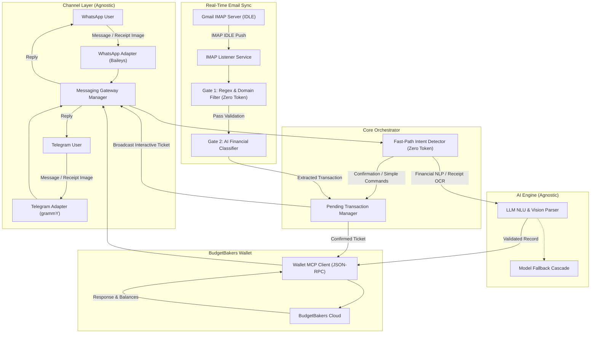

# AI Bookkeeper for BudgetBakers Wallet (WhatsApp & Telegram)

[](https://www.typescriptlang.org/) [](https://nodejs.org/) [](https://aistudio.google.com/) [](https://github.com/WhiskeySockets/Baileys) [](https://grammy.dev/) [](https://web.budgetbakers.com/settings/mcp-server) [](LICENSE)

An automated personal bookkeeping assistant via **WhatsApp** and **Telegram** integrated directly with BudgetBakers Wallet through the official Model Context Protocol (MCP) Streamable HTTP endpoint. Powered by an agnostic AI provider (Google Gemini, OpenRouter, Groq, Ollama, OpenAI), the system converts natural language chats and physical receipt photos into structured wallet records, monitors bank/e-wallet notification emails in real time, and requests interactive confirmation before committing financial records.

---

## Architecture Flow



---

## Key Features

- **Natural Language Transaction Recording**: Parse casual Indonesian shorthand (e.g., *"Kopi kenangan 28rb bca"*, *"Makan siang padang 35rb tunai"*, or *"Gaji masuk 7.5jt ke Mandiri"*).
- **Physical Receipt Photo OCR**: Send photos of physical paper receipts or invoices; AI vision extracts merchant, transaction timestamp, line items, total amount, and categorizes automatically.
- **Real-Time Bank & E-Wallet Email Sync**: Automatically monitors transaction emails via Gmail IMAP IDLE for **Bank Mandiri (Livin), Bank Jago, GoPay, OVO, DANA, and ShopeePay**.
- **Two-Gate Spam & Promo Defense Engine**:
  - **Gate 1**: Header, sender domain, regex validation, security keyword blacklist (OTP, login alerts, promos), and in-memory deduplication (zero AI tokens spent).
  - **Gate 2**: AI structured schema extraction for verified financial notifications.
- **Interactive Multi-Channel Confirmation Queue**: Bank email transactions generate numbered interactive tickets (`#1`, `#2`) broadcasted to WhatsApp and Telegram. Confirm individually (`Ya 1`, `Catat 1`), in bulk (`Ya semua`, `Catat semua`), or cancel (`Batal 1`, `Batal semua`).
- **Budget & Balance Inquiries**: Check balances across accounts (*"Cek saldo rekening"*, *"Berapa sisa BCA?"*) or inspect budget limits (*"Status budget bulan ini"*).
- **Zero-Token Fast-Path Processor**: Confirmation commands and simple keywords bypass LLM processing entirely for instant response times and token savings.
- **Channel Security Whitelist**: Strict WhatsApp phone number and Telegram User ID whitelist restrictions ensure only authorized users can interact with the bot.

---

## Tech Stack & Libraries

- **Language & Runtime**: TypeScript 5.x on Node.js (tested on LTS v18 and v20+ via `tsx`)
- **AI / NLU Engine**: Agnostic AI Provider supporting Google Gemini API via `@google/genai`, plus OpenRouter, Groq, Ollama, OpenAI
- **Messaging Gateways**:
  - WhatsApp: `@whiskeysockets/baileys` (Multi-device WhatsApp Web socket API)
  - Telegram: `grammy` (Modern, native TypeScript Telegram Bot framework)
- **MCP Client**: Custom JSON-RPC over HTTP client targeting BudgetBakers Wallet MCP Server
- **Email Synchronization**: `imapflow` (IMAP IDLE push events) and `mailparser` (RFC 822 stream parsing)
- **Logging**: `pino` with rotating daily file logs and clean console output

---

## Prerequisites

1. **Node.js**: Version 18.0.0 or higher.
2. **AI Provider API Key**:
   - Google Gemini: Obtain a free key from [Google AI Studio](https://aistudio.google.com).
   - Or OpenRouter / Groq / OpenAI / Ollama.
3. **BudgetBakers Wallet MCP Token**:
   - Access [BudgetBakers MCP Server Settings](https://web.budgetbakers.com/settings/mcp-server).
   - Generate a **Personal Access Token** with required scopes (`records.create`, `records.read`, `accounts.read`, `categories.read`, `budgets.read`).
4. **Messaging Credentials (At least one required)**:
   - **WhatsApp**: Your phone number for `ALLOWED_PHONE_NUMBER`.
   - **Telegram**: A bot token from [@BotFather](https://t.me/BotFather) (`TELEGRAM_BOT_TOKEN`) and your Telegram user ID from [@userinfobot](https://t.me/userinfobot) (`TELEGRAM_ALLOWED_USER_ID`).
5. **Google App Password (Optional for Email Sync)**:
   - If enabling real-time bank email monitoring:
     1. Enable 2-Step Verification on your Google Account.
     2. Navigate to Google Account > Security > App Passwords.
     3. Create an app password (e.g., named "Wallet Bot") and keep the 16-character secret.

---

## Installation & Setup

### 1. Clone and Install Dependencies

```bash
git clone https://github.com/Churma16/wallet-mcp-budgetbakers-bot.git
cd wallet-mcp-budgetbakers-bot
npm install
```

### 2. Environment Configuration

Copy the example environment file and populate your credentials:

```bash
cp .env.example .env
```

Key environment variables:

| Variable | Description | Example / Default |
| :--- | :--- | :--- |
| `ENABLED_MESSENGER_CHANNELS` | Active messaging channels (`whatsapp`, `telegram`, or `whatsapp,telegram`) | Auto-detect |
| `ALLOWED_PHONE_NUMBER` | Authorized WhatsApp number (international format) | `6281234567890` |
| `WHATSAPP_SESSION_PATH` | Local directory for multi-device credentials | `./auth_session` |
| `TELEGRAM_BOT_TOKEN` | Telegram Bot Token from @BotFather | `123456789:ABC...` |
| `TELEGRAM_ALLOWED_USER_ID` | Telegram User ID whitelist | `123456789` |
| `AI_PROVIDER` | Active AI Provider (`gemini`, `openrouter`, `groq`, `ollama`, `openai`) | `gemini` |
| `GEMINI_API_KEY` | Google Gemini API authentication key | `AIzaSy...` |
| `GEMINI_MODEL` | Primary Gemini model identifier | `gemini-3.6-flash` |
| `GEMINI_FALLBACK_MODELS` | Comma-separated cascade fallback models | `gemini-3.5-flash,gemini-3.5-flash-lite` |
| `GEMINI_TIMEOUT_SECONDS` | Request timeout before triggering fallback | `20` |
| `OPENROUTER_API_KEY` | OpenRouter API Key (if `AI_PROVIDER=openrouter`) | `sk-or-v1-...` |
| `AI_MODEL` | Active model for OpenRouter / Groq / Ollama / OpenAI | `google/gemini-2.0-flash-exp:free` |
| `AI_BASE_URL` | Custom endpoint for OpenAI-compatible providers | `http://localhost:11434/v1` |
| `WALLET_MCP_BASE_URL` | BudgetBakers Wallet MCP endpoint | `https://mcp.wallet.budgetbakers.com` |
| `WALLET_MCP_ACCESS_TOKEN` | BudgetBakers Personal Access Token | `pat_...` |
| `LOG_RETENTION_DAYS` | Daily log rotation retention period | `7` |
| `EMAIL_SYNC_ENABLED` | Toggle real-time bank email sync via IMAP | `true` or `false` |
| `EMAIL_IMAP_HOST` | IMAP server address | `imap.gmail.com` |
| `EMAIL_IMAP_PORT` | IMAP SSL port | `993` |
| `EMAIL_IMAP_USER` | Gmail address receiving bank notifications | `user@gmail.com` |
| `EMAIL_IMAP_PASSWORD` | 16-character Google App Password | `abcd efgh ijkl mnop` |
| `EMAIL_LOOKBACK_MINUTES`| Lookback window on initial startup | `10` |

### 3. Verify Integrations & Connection Tests

Run the built-in diagnostic scripts to confirm API connectivity before starting:

```bash
# Verify Wallet MCP credentials, scopes, accounts, and categories
npm run test:mcp

# Verify active AI Provider NLU and email transaction extraction
npm run test:ai

# Verify Gate 1 bank email rules and confirmation intent detection
npm run test:email-rules

# Verify Gmail IMAP connection & credentials (if email sync is enabled)
npm run test:email

# Test live email fetching and Gate 1 filtering against your inbox
npm run test:email-gate-live

# Verify Telegram Bot API token & whitelisted user dispatch
npm run test:telegram
```

### 4. Start the Application

Start in development mode with auto-reload:
```bash
npm run dev
```

Or start for production:
```bash
npm start
```

**Messaging Channel Setup:**
- **WhatsApp**:
  1. A QR code will display in the terminal upon startup.
  2. Open WhatsApp: Settings > **Linked Devices** > **Link a Device** and scan.
  3. Credentials persist inside `./auth_session`. Subsequent restarts reconnect automatically.
- **Telegram**:
  1. Set `TELEGRAM_BOT_TOKEN` and `TELEGRAM_ALLOWED_USER_ID` in `.env`.
  2. Start your bot on Telegram by sending `/start` from your whitelisted user account.

---

## Usage Scenarios & Commands

Send messages from your whitelisted WhatsApp or Telegram account to the bot:

| Scenario | Message Example (WhatsApp / Telegram) | System Action |
| :--- | :--- | :--- |
| **Expense Recording** | *"Kopi kenangan 28rb bca"* | Resolves account `BCA`, categorizes as `Food & Beverage`, creates expense record. |
| **Detailed Expense** | *"Beli bensin pertamax 50rb cash, note: rest area km 57"* | Creates expense under `Cash` with category `Transportation` and custom note. |
| **Income Recording** | *"Gaji masuk 7.5jt ke Mandiri"* | Resolves account `Mandiri`, categorizes as `Salary`, creates income record. |
| **Receipt OCR** | Send an image of a physical receipt | Extracts merchant name, line items, transaction date, and creates record. |
| **Confirm Single Email** | *"Ya"* or *"Catat"* | Confirms and records the most recent bank email notification ticket. |
| **Confirm Specific Ticket**| *"Ya 1"* or *"Catat #2"* | Confirms and records ticket `#1` or `#2` from the queue. |
| **Bulk Confirmation** | *"Ya semua"* or *"Catat semua"* | Processes and records all pending tickets sequentially. |
| **Cancel Ticket** | *"Batal 1"* or *"Batal semua"* | Dismisses transaction tickets from the pending queue. |
| **Check Balances** | *"Cek saldo rekening"* or *"Berapa saldo BCA?"* | Queries Wallet MCP and lists current balances for specified or all accounts. |
| **Check Budgets** | *"Status budget bulan ini"* | Queries Wallet MCP and summarizes spending limits vs remaining amounts. |

---

## Project Structure

```
wallet-mcp-budgetbakers-bot/
├── src/
│   ├── config/
│   │   ├── bankEmailRules.ts            # Rule definitions for Mandiri, Jago, GoPay, OVO, DANA, ShopeePay
│   │   └── environmentConfig.ts         # Environment validation and typed configurations
│   ├── types/
│   │   └── walletTypes.ts               # Wallet MCP interfaces (Account, Category, Record, Budget)
│   ├── services/
│   │   ├── ai/                          # Agnostic AI Provider implementations
│   │   │   ├── aiProvider.ts            # Common AI provider contract & factory
│   │   │   ├── geminiProvider.ts        # Google Gemini native provider with model fallback
│   │   │   └── openAiCompatibleProvider.ts # OpenAI / OpenRouter / Groq / Ollama provider
│   │   ├── messaging/                   # Channel-agnostic messaging gateways
│   │   │   ├── types.ts                 # Adapter interfaces and messaging event contracts
│   │   │   ├── messagingGatewayService.ts # Gateway orchestrator managing active channels
│   │   │   ├── messageFormatHelper.ts   # Formatting converter (WhatsApp markup to Telegram HTML)
│   │   │   ├── whatsappAdapter.ts       # Baileys WhatsApp Web socket adapter
│   │   │   └── telegramAdapter.ts       # grammY Telegram Bot adapter
│   │   ├── emailListenerService.ts      # Gmail IMAP IDLE real-time subscriber and parser
│   │   ├── pendingTransactionManager.ts # Interactive confirmation ticket queue
│   │   └── walletMcpClient.ts           # BudgetBakers Wallet MCP HTTP JSON-RPC client
│   ├── utils/
│   │   ├── emailLogicGate.ts            # Gate 1 rule evaluator (sender domain, blacklist, anti-dupe)
│   │   ├── fastPathIntentDetector.ts    # Zero-token intent classifier and confirmation parser
│   │   ├── humanResponseFormatter.ts    # Indonesian response templates and formatting
│   │   ├── logger.ts                    # Pino logger instance with daily file rotation
│   │   └── recordValidator.ts           # Account/category index resolver and payload sanitizer
│   ├── scripts/
│   │   ├── testAiProvider.ts            # Diagnostic script for active AI provider NLU
│   │   ├── testEmailGateRules.ts        # Unit test suite for Gate 1 filtering logic
│   │   ├── testEmailImap.ts             # Diagnostic script for Gmail IMAP connectivity
│   │   ├── testFetchRealEmailsGate.ts   # Live inbox diagnostic for Gate 1 rule evaluation
│   │   ├── testFormatter.ts             # Validation script for human-friendly response strings
│   │   ├── testMessageFormat.ts         # Unit test for WhatsApp markup to Telegram HTML converter
│   │   ├── testTelegramBot.ts           # Diagnostic script for Telegram bot connectivity & dispatch
│   │   └── testWalletMcp.ts             # Diagnostic script for BudgetBakers MCP endpoints
│   └── index.ts                         # Application bootstrap and service orchestrator
├── .env.example                         # Environment variable template
├── package.json                         # Node dependencies and execution scripts
├── tsconfig.json                        # TypeScript compiler configuration
├── LICENSE                              # MIT License
└── README.md                            # Project documentation
```


---

## Security & Privacy Considerations

- **Self-Hosted, No Intermediary Proxy**: This tool is a self-hosted client application with no additional relay, proxy, or intermediary servers. Your messages and financial data travel directly between your machine and the respective endpoints (AI provider API and BudgetBakers MCP). Note that **NLU processing and receipt OCR do require sending transaction text or images to your configured AI provider** (e.g. Google Gemini, OpenRouter) as part of the cloud API call — no third-party middleware is involved beyond that direct connection.
- **Whitelisted Access**: Incoming messages from unapproved numbers are rejected immediately before reaching the AI or MCP layers.
- **Isolated Local Sessions**: WhatsApp connection tokens and keys are stored in the local `./auth_session` folder and excluded from git tracking.
- **Two-Gate Email Protection**: Promotional campaigns, newsletter updates, and sensitive security alerts (such as OTP codes or device verification notifications) are dropped by Gate 1 regex patterns without transmitting content to cloud AI APIs.
- **Zero Raw Emojis in System Logs**: System outputs and logs follow strict formatting tags (`[INFO]`, `[SUCCESS]`, `[WARN]`, `[ERROR]`) for clean and predictable terminal/file parsing.

---

## Disclaimer

This is an independent open-source project and is **not** officially affiliated with, maintained by, or endorsed by BudgetBakers or Meta Platforms, Inc. (WhatsApp). WhatsApp automation relies on multi-device Web protocols via Baileys; use this software responsibly and at your own discretion.

---

## Author
 
 Developed by [churma16](https://github.com/churma16).

---

## License

This project is licensed under the [MIT License](LICENSE).

