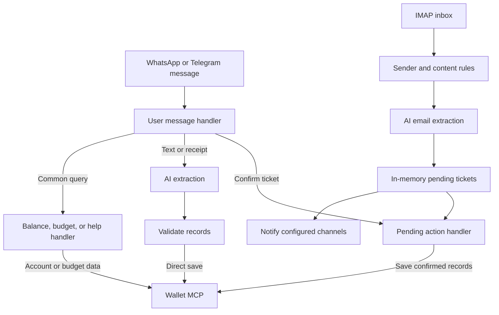

# Architecture

[Back to README](../README.md)

The application uses TypeScript, Baileys for WhatsApp, grammY for Telegram, an HTTP JSON-RPC client for Wallet MCP, and ImapFlow/mailparser for email. Gemini has a native provider implementation; other configured AI endpoints use an OpenAI-compatible client.

## Message flow

Chat and receipt processing calls Wallet after validation without creating an approval ticket. Email processing creates a ticket and sends a notification; a later confirmation saves the record. Balance and budget handlers read Wallet data, while help returns a local response.

## Source map

| Location | Responsibility |
| --- | --- |
| [src/index.ts](../src/index.ts) and [src/app.ts](../src/app.ts) | Startup, dependency wiring, and lifecycle |
| [src/config/](../src/config/) | Environment configuration and bank email rules |
| [src/handlers/](../src/handlers/) | User messages, email extraction, queries, and pending actions |
| [src/services/messaging/](../src/services/messaging/) | Channel adapters, gateway, and formatting |
| [src/services/ai/](../src/services/ai/) | Provider construction, prompts, extraction, and fallback |
| [emailListenerService.ts](../src/services/emailListenerService.ts) | Inbox monitoring and email deduplication |
| [pendingTransactionService.ts](../src/services/pendingTransactionService.ts) | Ticket IDs, lookup, cancellation, and 24-hour expiry |
| [walletCacheService.ts](../src/services/walletCacheService.ts) | Cached account and category data |
| [walletMcpService.ts](../src/services/walletMcpService.ts) | Wallet API calls |
| [src/i18n/](../src/i18n/) and [src/utils/](../src/utils/) | Response dictionaries, validation, command matching, and logging |
| [tests/](../tests/) | Offline suites and live diagnostics |

## State and failure handling

- Pending tickets use an in-memory map with pending, processing, and unknown-outcome states. Unprocessed tickets expire after 24 hours; processing and unknown-outcome tickets are retained in memory. None survive restart.
- Email deduplication stores message IDs and reference numbers in `data/processed_transaction_cache.json`. Transaction candidates are cached after downstream handling succeeds; initial-gate rejections are cached immediately. This cache is not a durable pending queue.
- Confirmation claims tickets before I/O to prevent concurrent dispatch and tracks completed record indexes for multi-record transactions. Definitive non-commit failures return to pending; uncertain outcomes block repeat dispatch and require manual reconciliation. Successful tickets are removed.
- AI fallback tries configured providers in order and propagates the last failure if none succeeds.
- The application installs a financial logging policy that summarizes detailed payloads by default. `DEBUG_FINANCIAL_PAYLOADS=true` enables detailed payload logging with credential redaction still active.

See [README limitations](../README.md#limitations-and-privacy) for known gaps and related issues, and [configuration](configuration.md) for runtime settings.
